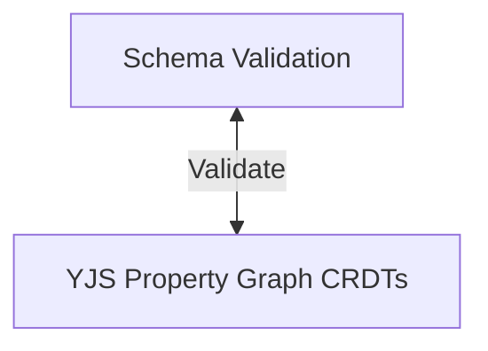
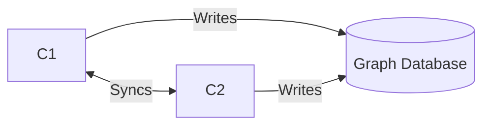
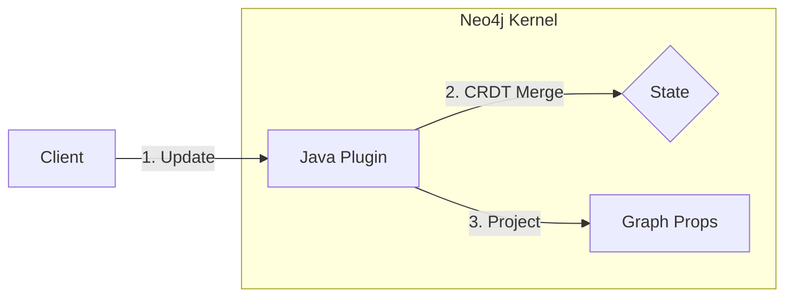
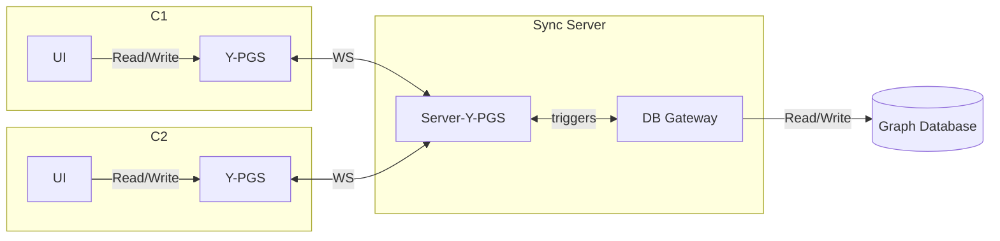
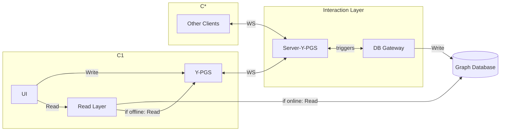
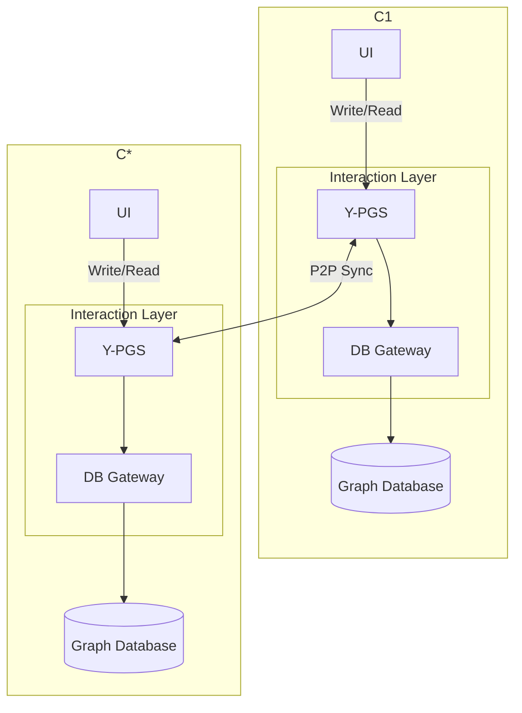
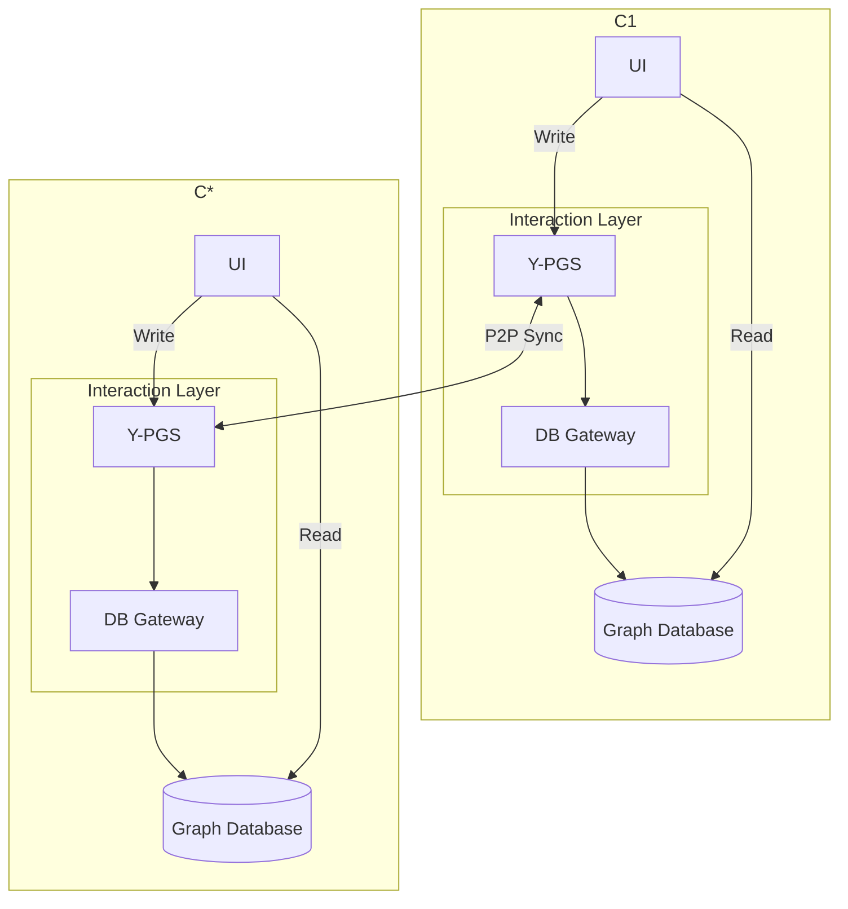
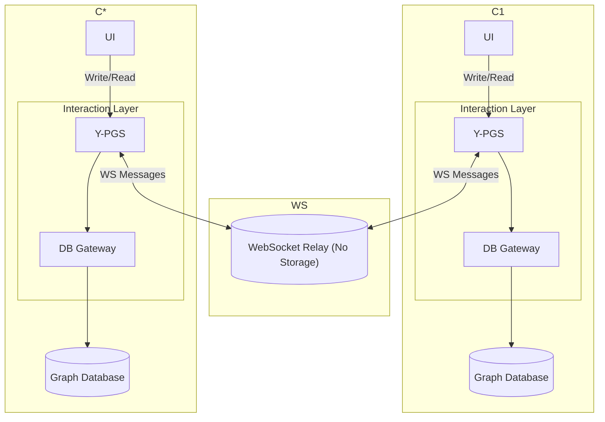

# Architecture Comparison & Decision Matrix

This document summarizes the architectural options explored for integrating **Yjs (Real-time Collaboration)** with **Graph Databases (Neo4j, ArangoDB, ...)**.

## 0. Abstraction
- Small sketch that scheme is indipendent of the basic Y-PG implementation.

## 1. Client-Side Direct Write 
**Concept:** Every Client connects directly to a Graph Database. Clients write updates to the Graph Database individually.

*   **Pros:**
    *   **Easy**
*   **Cons:**
    *   **Race Conditions** 
    *   **Dualism:** Data exists in `y-indexeddb` (Client Cache) and Graph Database independently. They drift apart easily.
*   **Opinion:** **No**.

---

## 2. Native CRDT Support (Neo4j Plugin IDEA NEO4J ONLY)
**Concept:** A custom Neo4j Plugin (in Java) that handels CRDT merging logic internally.

*   **Pros:**
    *   **Perfect Integration:** Seamlessly handles conflict resolution within the database engine.
    *   **Consistency:** No risk of race conditions.
*   **Cons:**
    *   **Complexity:** Complex to implement - not necessary to argue about schema consistency, path consistency, etc. - not 100% sure if it is completly possible
    *   **Maintenance:** Requires maintaining custom Java code that deeply hooks into Neo4j internals. - could break after an update.
*   **Opinion:** **Not Recommended**. High effort and risk for a thesis project.

---

## 3. Gateway Architecture
**Concept:** A centralized **Node.js Sync Server** acts as the *Single Source of Truth*. It holds the Yjs document in RAM and acts as the **Sole Writer** to the Graph Database.

*   **Pros:**
    *   **Focused:** Only the Sync Server writes to the Graph Database. No risk of race conditions.
    *   **Goal:** Easy to argue about the wanted constraints. (Schema, Schema Evolution, Path Consistency, ...)
    *   **Compatible:** Compatible with different Graph Databases. Just change the write / load functions.
    *   **Concurrency:** Handeled by our implementation of YJS Property Graph CRDTs.
    *   **Consistency:** The Graph Database always reflects the converged state. No "overwrite" bugs.
*   **Cons:**
    *   **Redundancy:** Data exists in Server YJS Document + Graph Database.
    *   **No Offline Querying:** You can't run full Cypher queries (`MATCH ...`) locally, offline.
    *   **
*   **Opinion:** **Recommended**. Easy way of arguing about the wanted constraints.

---

### 3.1 Gateway Architecture with optimized Read

*   **Optimizes:**
    *   **Offline Querying:** Implement a YJS Graph Traversal Layer that can run locally. -> **CON** Not really efficient and limited.

## 5. Distributed / Local-First (Thick Gateway)
**Concept:** Each client runs a **Local Graph Database** instance + a **Local Sync Server**.

*   **Pros:**
    *   **Resilience:** No central point of failure.
*   **Cons:**
    *   **Resources:** Running Graph Database (JVM) on every client is very heavy.
    *   **Sync Complexity:** You essentially run the "Gateway Architecture" on every device.
    *   **Offline Querying:** You can't run full Cypher queries (`MATCH ...`) locally, offline.
    *   **Data Duplication:** Data exists in Server YJS Document + Graph Database.
*   **Opinion:** **I like it**. 

### 5.1. Decoupled Read / Write

Read from the Graph Database directly. Write via the Sync Server.

*   **Optimizes:**
    *   **Offline Querying:** You can run full Cypher queries (`MATCH ...`) locally, even offline.
    *   **Data Duplication:** Data exists in Server YJS Document + Graph Database.

### 5.2 Hybrid / Relay (WebSocket)
**Concept:** Clients run **Local Graph Database** but sync via a central **WebSocket Relay Server**.
> The WS server could be used as a global constraint solver. [Cyclicity, Path Existence, ...] - single source of truth
But single point of failure! Still local work could be done.

-> WS instead of P2P Sync

## Summary

| Feature | Client-Side Write | Gateway Architecture | Native Plugin | Distributed (Local DB) |
| :--- | :--- | :--- | :--- | :--- |
| **Conflict Resolution** | Poor (Last Write Wins) | Reliable (CRDTs) | Reliable (CRDTs) | **Reliable (Local Gateway)** |
| **Data Querying** | **Good** | **Good** (Remote)  | **Perfect** | **Perfect (Local)** |
| **Complexity** | Low | **Medium** | **High** | **Medium** |

