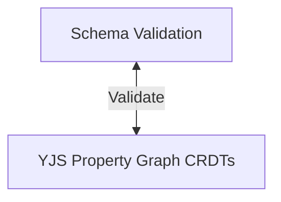
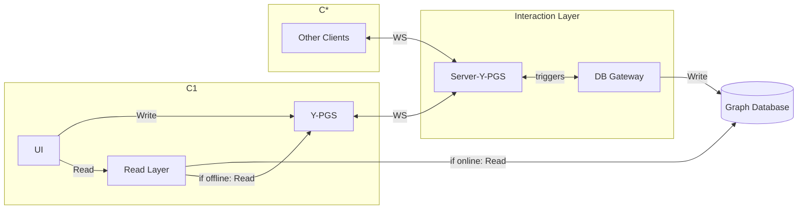
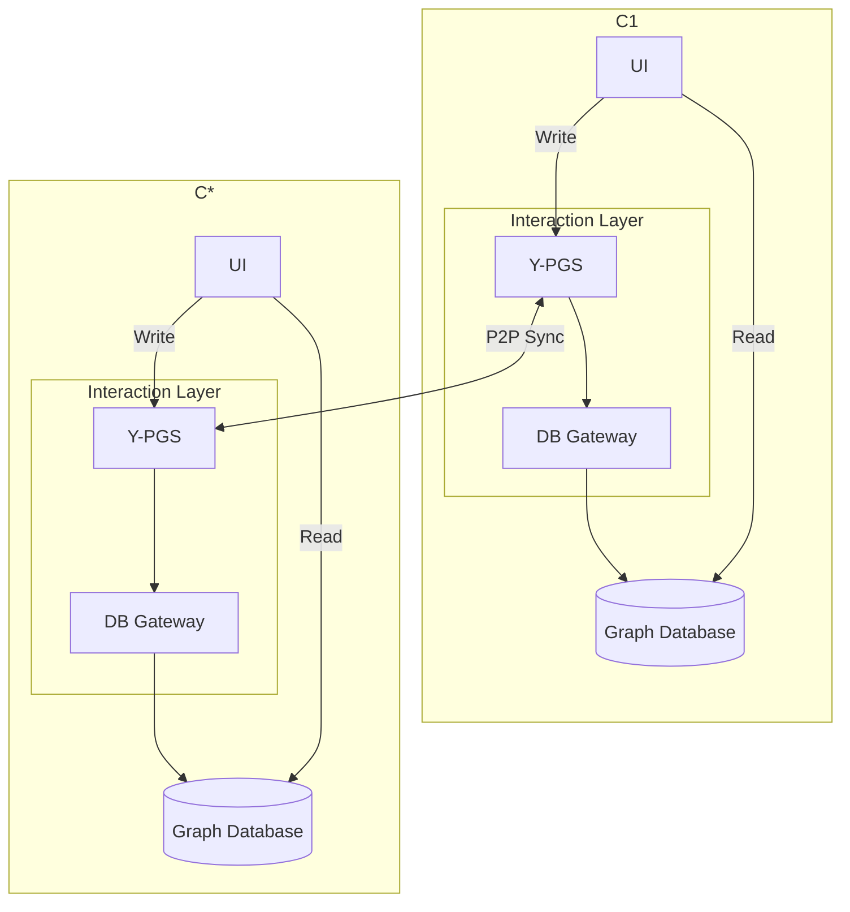
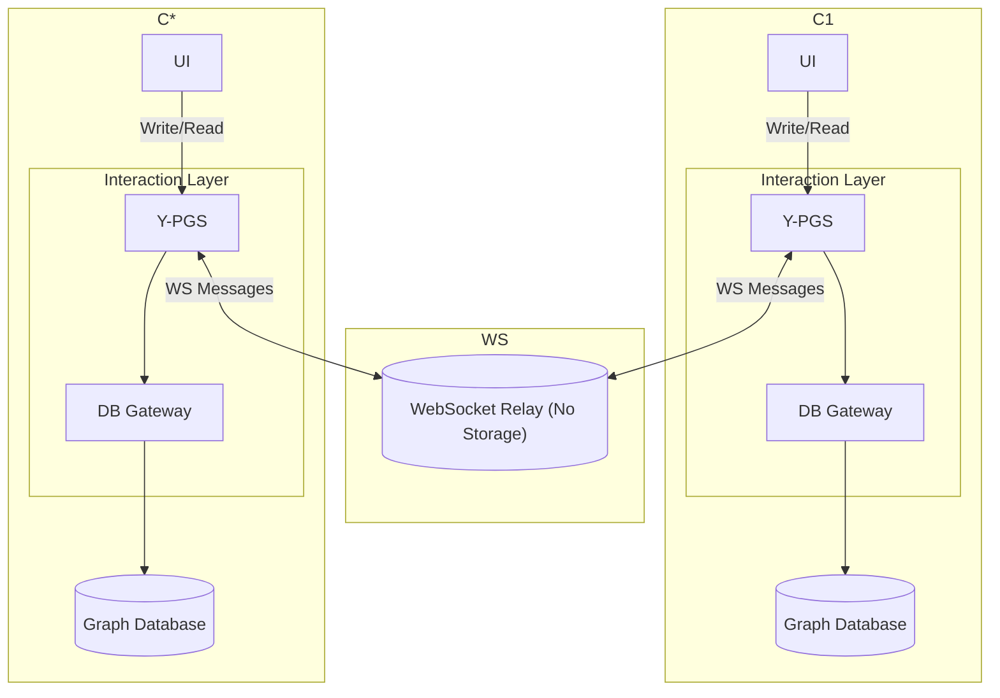

# Architecture Comparison & Decision Matrix

This document summarizes the architectural options explored for integrating **Yjs (Real-time Collaboration)** with **Graph Databases (Neo4j, ArangoDB, ...)**.

## 0. Abstraction
- Small sketch that scheme is indipendent of the basic Y-PG implementation.

### 3 Gateway Architecture with optimized Read
**Concept:** A centralized **Node.js Sync Server** acts as the *Single Source of Truth*. It holds the Yjs document in RAM and acts as the **Sole Writer** to the Graph Database.

*   **Optimizes:**
    *   **Offline Querying:** Implement a YJS Graph Traversal Layer that can run locally. -> **CON** Not really efficient and limited.

## 5. Distributed / Local-First (Thick Gateway)
**Concept:** Each client runs a **Local Graph Database** instance + a **Local Sync Server**.
Read from the Graph Database directly. Write via the Sync Server.

*   **Optimizes:**
    *   **Offline Querying:** You can run full Cypher queries (`MATCH ...`) locally, even offline.
    *   **Data Duplication:** Data exists in Server YJS Document + Graph Database.

### 5.2 Hybrid / Relay (WebSocket)
**Concept:** Clients run **Local Graph Database** but sync via a central **WebSocket Relay Server**.
> The WS server could be used as a global constraint solver. [Cyclicity, Path Existence, ...] - single source of truth
But single point of failure! Still local work could be done.

-> WS instead of P2P Sync
