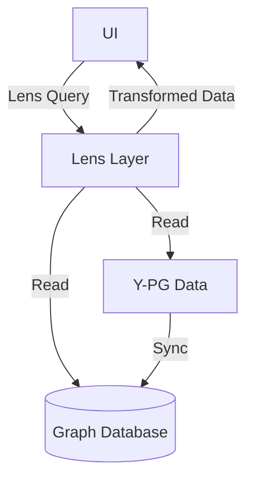

# Architecture Extension
4. **Lens Integration** 
This is kinda independent of the architecture above. It is more about the data model and how it is represented read/written.

```mermaid
graph TD
    UI[UI] -->|Lens Query| Lens[Lens Layer]
    Lens -->|Read| YPG[Y-PG Data]
    Lens -->|Read| DB[(Graph Database)]
    YPG -->|Sync| DB
    Lens -->|Transformed Data| UI
```
