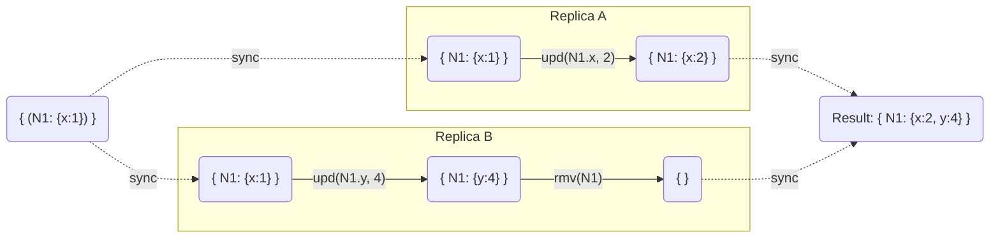
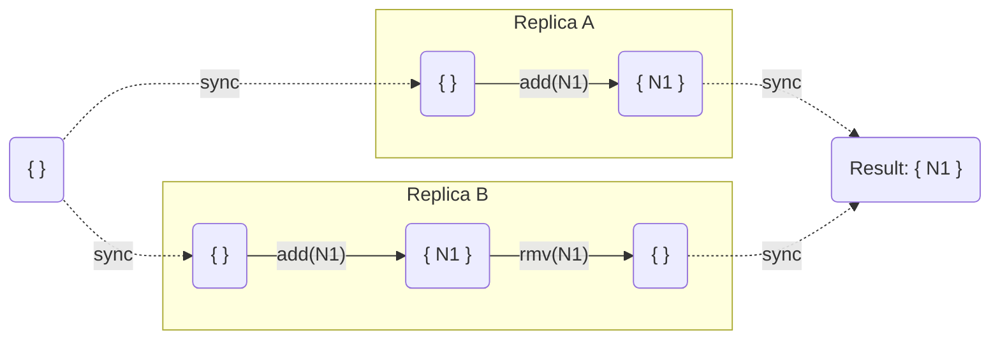
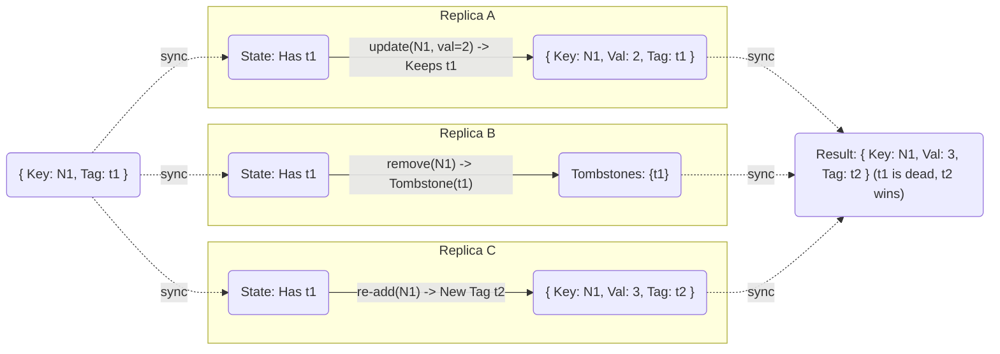
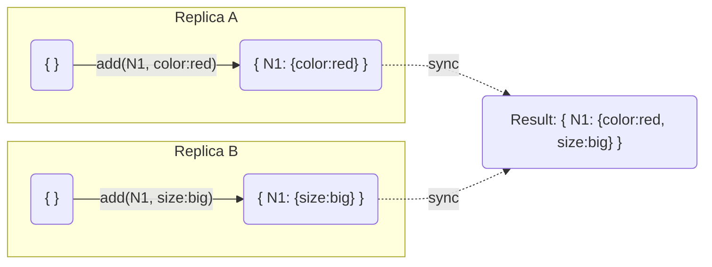

# Introduction
-- as a basis see: https://arxiv.org/pdf/1806.10254 | https://arxiv.org/abs/1210.3368

We define as basis of our Graph an CRDT Map that supports: 

* **Create** - Adds a new entry to the map
* **Update** - Updates an existing entry in the map.
* **Remove** - Removes an entry from the map.

This gives us the Question: How does it behave in different merging scenarios?

The two I want to focus on are:

## Add/Update Win Semantic 
> Never Remove Property Data on a remove to ensure that the property data is always available if a node will be updated or readded again.

### Scenarios:

#### Scenario 1: Update Wins / Add Wins (The "Resurrection")
Context: concurrent `upd(N1)` vs `rmv(N1)`.

> **Logic:** The update `x=2` implies the existence of `N1`. The "Removed" flag from B is overwritten or ignored because the update timestamp acts as a "Latest Write" that validates the node's existence.

#### Scenario 2: Add Wins / Remove Wins (The "Resurrection")
Context concurrent `add(N1)` vs `rmv(N1)`.

> **Logic:** The adding concurrent to an remove implies the existence of `N1`. The "Removed" flag from B is overwritten or ignored because the adding timestamp acts as a "Latest Write" that validates the node's existence.

## Observed Remove Win Semantic (Explicit Tag + Tombstone)

### Mechanism
*   **Add/Ref**: `Key -> { Value: v, Tag: t1 }`
*   **Remove**: `Tombstones.add(t1)`
*   **Visibility**: Visible if `entry.Tag` is NOT in `Tombstones`.

### Update to Dead Version vs Re-Add (Resurrection)
Context: 
1. **Replica B** removes `N1` (adding tag `t1` to Tombstones). 
2. **Replica A** concurrent update acts on *dead* tag `t1`.
3. **Replica C** concurrent Re-Add creates *new* tag `t2`.

> **Logic:** 
> *   Update from **A** refers to `t1`. Since `t1` is in `Tombstones` (from **B**), this entry is **Hidden/Ignored**.
> *   Re-Add from **C** generated `t2`. `t2` is NOT in Tombstones. **N1 is visible (Resurrected) with value 3.**

## Concurrent Adds (Convergent Merge)
Context: Both clients add the same Node/Edge with **Deterministic ID**, generating the *same* Tag (or just sharing the Key and merging properties).

> **Logic:** If IDs are deterministic, Yjs treats them as the same Map. Concurrent operations simply merge properties. No "Duplicates".
