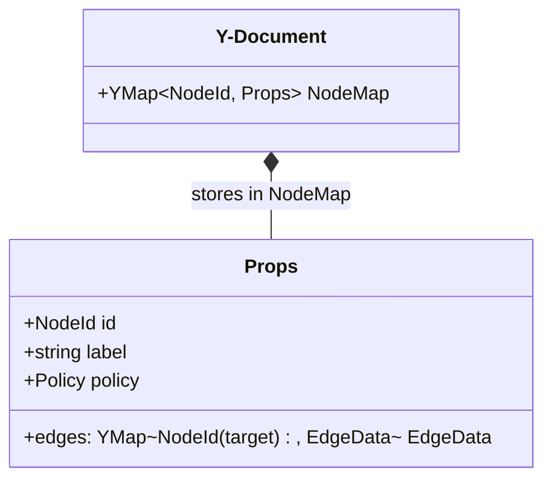
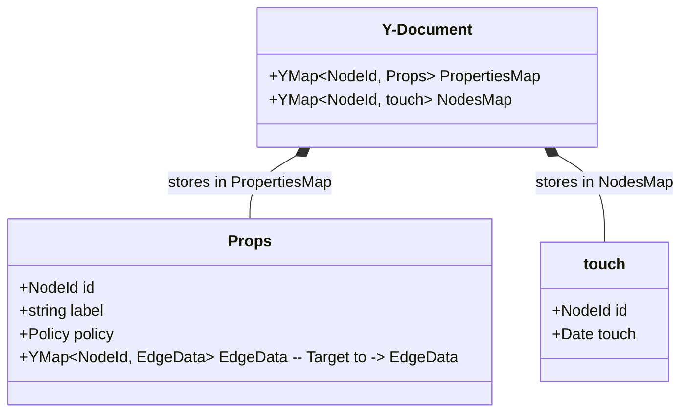
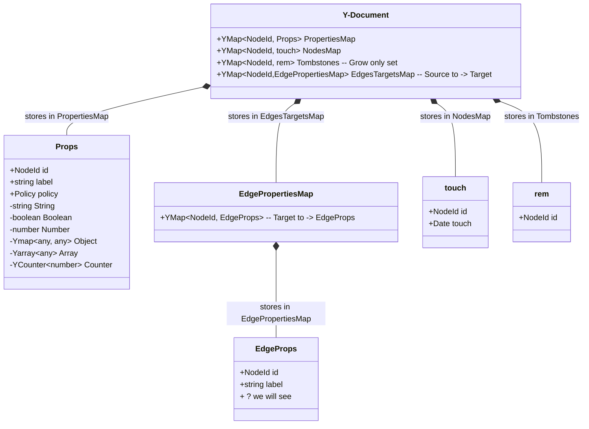

# Idea how to evaluate:
- speed and storage usage (Additionally test maybe loro, bc automerge is to slow - based on Evelyns Thesis)
- synchronazation delay
# Base {Version 0}
<!-- ```

YMap<NodeId, Props> - NodeMap

Props :{
    id: NodeId;

    label: string;

    policy: Policy;

    position: XYPosition;
    
    edges: YMap<NodeId (target), EdgeData>

}


``` -->



YJS Map - Add is Add - Win Semantic. BUT an Update on an internal sturcture does not count as an Add => therefore achiving concurrent update relations and remove Operations are in an **Remove Win** correlation. 
Can  I frame the Update as an add??? 


# Version 1

<!-- ```
YMap<NodeId, Props> - NodeMap

Props :{
    id: NodeId;

    label: string;

    policy: Policy;

    position: XYPosition;
    
    edges: YMap<NodeId (target), EdgeData>

}

YMap<NodeId, touch> - Add counter
``` -->



=> for n nodes we store 2 * n entries 
=> resulting in an Map with Add/Update Win Semantic


# Version 2

<!-- ```
YMap<NodeId, Props> - NodeMap

Props :{
    id: NodeId;

    label: string;

    policy: Policy;

    position: XYPosition;
}

EdgeLabel: YMap<Label, EdgeData>

YMap<NodeId, touch> - Add counter

YMap<NodeId, rem> - Tombstones (Grow only set)
``` -->




=> for n nodes we store max ~ 2 * n + Number of all adds entries (of nodes that are remove win)
=> resulting in an add win (update win policy) and remove win combination option. 
? Garbage collection ? Is it wanted to DELETE ALL! (Yes you can structure it better. see V3)

=> Edgees are now stored top level for easier merging.


## Update Idea Collection:

Try combine Tombstones and Add Toucher - maybe more efficient in storage. 

Idea: Combining the idea of an observe remove set. 

Idea new structure observed depended remove map: 

```
Map<key, value> - 

operations:

- add - LWW overrites the value completly => generates new identifier of the key
  
- update - update a value (usable when nested) => uses the current identifier of the key !! only update when identifier = identifier
  
- remove - removes the observed version of the adds before. => removes all versions before the key it self observed.
  

```

=> resulting in a possible idea of schema development. I. e. When changing from Rem Win to add Win hard cut via adding the object into the add win store.
Maybe need a extra check.


Overall Problem regarding Edges. The current implementation only focuses on having only one edge between nodes. How to handle duality? 
Having a type in the name AND a unique identifier to know which informations to merge


# Schema V1 

