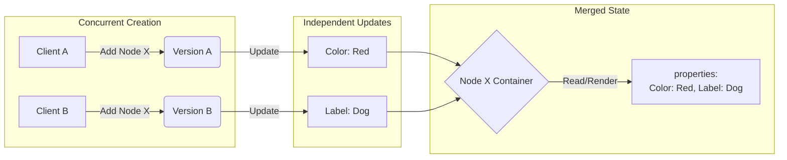
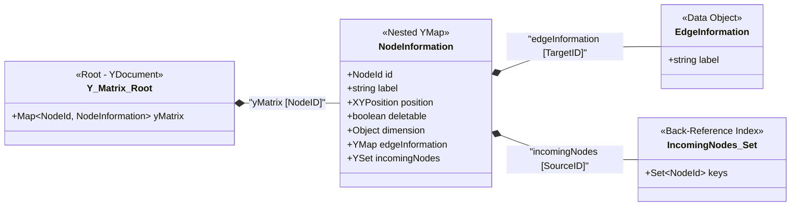
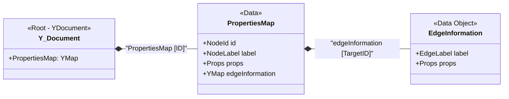
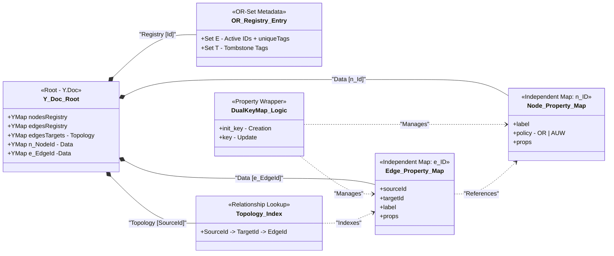
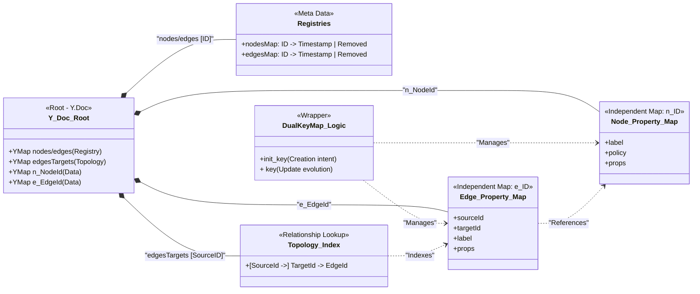
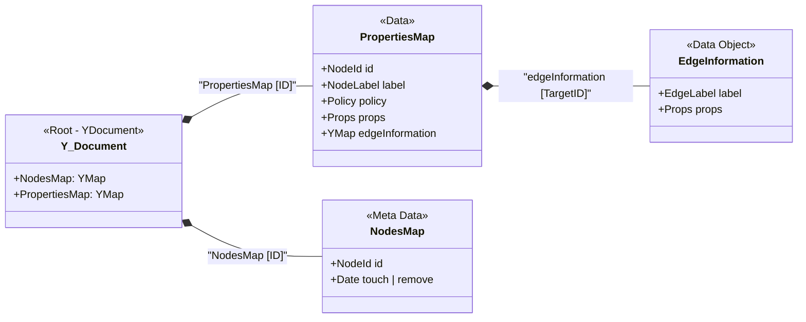

# Idea how to evaluate:
- speed and storage usage (Additionally test maybe loro, bc automerge is to slow - based on Evelyns Thesis)
- synchronazation delay

# Open Design Questions

## Correct concurrent adding logic of the SAME node
How is the correct Logic of adding a node? 
Scenario:

        C1 -> add -> Update -> Sync
        
        C2 -> add -> Sync

### What is the  remove policy for edges? 
My Decision: Add wins -> meaning

Should Update or Add Win?

## Inital values of a new node
Will a newly added node have basic values for its necessary properties or will alredy be filled with an value? 

## Concurrency operation modes.
Okay this is a bit more complex. I have three Ideas what would be a good ide to support:

### 1. Simple Solution
**Add wins** - Always keep the date and a concurrent add reinserts the visibility - all updates will be reseved and update the data. \
**Remove wins** - A node will be *forever* removed. - no reinsertion possible.

### 2. Medium Solution
**Add wins** - Always keep the date and a concurrent add reinserts the visibility - all updates will be reseved and update the data. \
**Simple Observe Remove wins** - Remove the visible versions of a node - does not affect concurrent adds. - readding possible. \
**BUT** - No really solution for concurrent updates. Every update will be included. Leading to possible data inconsistency. If that is not wanted.

### 3. Complex Solution - What I think we should go for.
**Add wins** - Always keep the date and a concurrent add reinserts the visibility - all updates will be reseved and update the data. \
**Complex Observed Remove wins** - Remove the version of a node - does not affect concurrent adds. - readding possible. Handle *Updates* as specific to a version of a node. Ignore updates that are of a version that is already removed. \
**Problem**: How to handle concurrent add and updates related to two different visible versions. -> Define a deterministic function that will on all clients choose the correct version.

# Evelyns Thesis Version [Adjacency Map With Faster Node Deletion]

# Base {Version 0 - Based on Evelyns Thesis}

YJS Map - Add is Add - Win Semantic. BUT an Update on an internal sturcture does not count as an Add => therefore achiving concurrent update relations and remove Operations are in an **Remove Win** correlation. 
Next Step Changing the YJS Structure to be a Add/Update Win Map.

## Version 3 {Changed Remove Win to Observed Remove Win} -- current main idea.

Assumptions:
- A Node has an ID that makes it unique.
- A Edge has an ID that makes it unique.
- A Node can have multiple edges to the same node.
- A Node can have edge(s) to itself.

Guarantees:
- Merging of the same node/edge when added concurently. (Keeping a combination of the properties and not overwriting one with the other) [this is why we have nodes and egdes as top level keys in the YDoc]
- Guarantees either Observed Remove Win or Add/Update Win based on the policy of the node/edge. [Possible to have different policies for nodes and edges - Schema Definition based]  - based on https://arxiv.org/abs/1210.3368
- Handles the race condition of concurrent Add and Update of the same node/edge. -> Update wins correctly reflecting the most recent user intent. [Dual-Key Logic]
- Topology Index helps faster lookup of edges from a node.
- Referential Integrity: edge are only "visible" / "exists" if the source node and target node is alive.
- Multi-Graph Support: By nested Topology Index.
- Idempotency: Re-adding a node or edge that already exists with the same ID results in a "no-op" or a property merge rather than a structural duplication, ensuring the graph state remains clean during network retries.

Drawbacks:
- Memory Grows because of the OR-Set Registry. 
- more meta Data because of the indipendent Maps for Nodes and Edges.

Optimizations:
- Tombstone Pruning.
- Implement a version of "An optimized OR-Set" - https://arxiv.org/abs/1210.3368
Possible in YJS when using fixed clientIDs, maintained by e.g.: a central suthentication or UserID system.
Would include it either when needed in scope or as a future optimization.

- Per Node and Edge we have an own TOP Level Y.Map.
# Version 2 {Dual-Key Logic}

- Adding Decoupled Register for Nodes And Edges. - Managing the "alive" state of the objects. Allows of different policies for different nodes and Edges
- Indipendent Data Maps for nodes and edges n_{id} and e_{id} -> Solves the issue of concurrent add of a node / edge
- Dual-Key Logic Entities are managed via a DualKeyMap wrapper that uses an init_ prefix for creation and a direct key for updates. This resolves "Creation vs. Update" race conditions, ensuring that initialization intent is preserved even if a concurrent update arrives out of order.
- Relationship Lookup via Topology Index. O(1) getting the edges from a node.

# Version 1 {Added alive Register}

- Adding Decoupled Register for Nodes. - Managing the "alive" state of the objects. Allows of different policies for different nodes.

=> resulting in an add win (update win policy) and remove win combination option. 
? Garbage collection ? Is it wanted to DELETE ALL!

