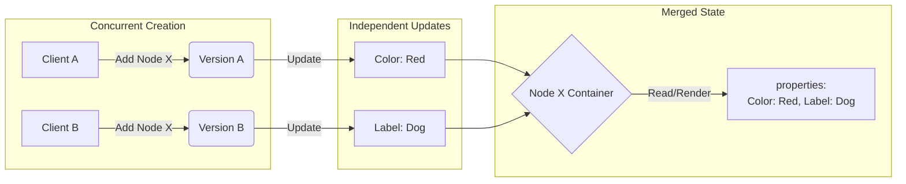

# Open Design Questions

## Correct concurrent adding logic of the SAME node
How is the correct Logic of adding a node? 
Scenario:

        C1 -> add -> Update -> Sync
        
        C2 -> add -> Sync

### What is the  remove policy for edges? 
My Decision: Add wins -> meaning

Should Update or Add Win?

## Inital values of a new node
Will a newly added node have basic values for its necessary properties or will alredy be filled with an value? 

## Concurrency operation modes.
Okay this is a bit more complex. I have three Ideas what would be a good ide to support:

### 1. Simple Solution
**Add wins** - Always keep the date and a concurrent add reinserts the visibility - all updates will be reseved and update the data. \
**Remove wins** - A node will be *forever* removed. - no reinsertion possible.

### 2. Medium Solution
**Add wins** - Always keep the date and a concurrent add reinserts the visibility - all updates will be reseved and update the data. \
**Simple Observe Remove wins** - Remove the visible versions of a node - does not affect concurrent adds. - readding possible. \
**BUT** - No really solution for concurrent updates. Every update will be included. Leading to possible data inconsistency. If that is not wanted.

### 3. Complex Solution - What I think we should go for.
**Add wins** - Always keep the date and a concurrent add reinserts the visibility - all updates will be reseved and update the data. \
**Complex Observed Remove wins** - Remove the version of a node - does not affect concurrent adds. - readding possible. Handle *Updates* as specific to a version of a node. Ignore updates that are of a version that is already removed. \
**Problem**: How to handle concurrent add and updates related to two different visible versions. -> Define a deterministic function that will on all clients choose the correct version.

## Scalability requirements
About what Graph Sizes to we argue about?

